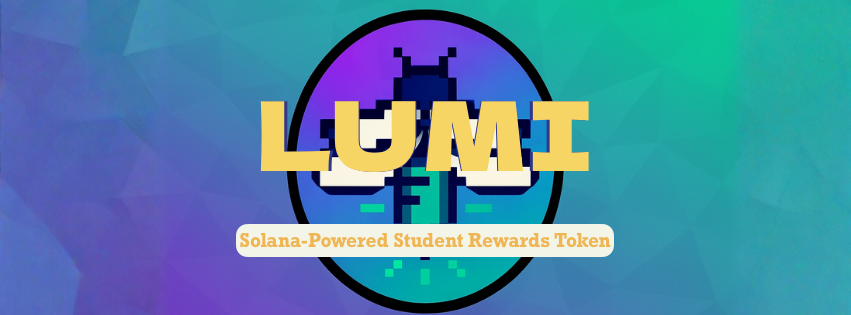

<p align="center">
  
</p>

# **LUMI — Atlas School Reward Token**

LUMI is a Solana SPL token created for Atlas School Tulsa to reward students for achievements, helpfulness, and community engagement.  
It includes a custom on‑chain program, a slick dashboard for issuing tokens, and a clean student UI for checking balances and testing the program with a small faucet — all running on Solana Devnet.

---

## Table of Contents
- [**LUMI — Atlas School Reward Token**](#lumi--atlas-school-reward-token)
	- [Table of Contents](#table-of-contents)
	- [Environment](#environment)
	- [Installation](#installation)
	- [Project Structure](#project-structure)
	- [How It Works](#how-it-works)
		- [1. Issuers reward students](#1-issuers-reward-students)
		- [2. Token delivery](#2-token-delivery)
		- [3. Student dashboard](#3-student-dashboard)
	- [Admin Dashboard](#admin-dashboard)
	- [Student Dashboard](#student-dashboard)
	- [Key Features](#key-features)
	- [Solana Concepts](#solana-concepts)
		- [SPL Token](#spl-token)
		- [PDA (Program Derived Address)](#pda-program-derived-address)
		- [ATA (Associated Token Account)](#ata-associated-token-account)
		- [Devnet](#devnet)
	- [Future Enhancements](#future-enhancements)
	- [About the Developer](#about-the-developer)
	- [License](#license)

---

## Environment

This project is developed and tested with:

- **Operating System:** macOS & Ubuntu 22.04  
- **Blockchain:** Solana Devnet  
- **On-chain Program:** Rust + Anchor  
- **Web App Framework:** Next.js (React + TypeScript)  
- **Packages:**  
  - `@coral-xyz/anchor`  
  - `@solana/web3.js`  
  - `@solana/spl-token`  
  - `@solana/wallet-adapter`  
  - `Vercel` for outside deployment 

---

## Installation

Clone and Navigate to the Project:

```bash
git clone https://github.com/internashionalist/LUMI.git
cd LUMI/app
```

Install Dependency
```bash
npm install
```

Create Your Environment File:

```bash
cp .env.local
```

Start the local development server:

```bash
npm run dev
```

Open the dashboard<br>
	**http://localhost:3000**

---

## Project Structure

```
LUMI/
 ├── app/                     # Next.js front-end application
 │   ├── pages/
 │   ├── lib/solana.ts        # helper functions + constants
 │   ├── public/LUMI.png      # token logo (Lumi!!!)
 │   └── ...
 ├── programs/lumi/           # Anchor + Rust program
 ├── target/                  # IDL + build artifacts
 ├── Anchor.toml
 ├── README.md
 └── ...
```

---

## How It Works

### 1. Issuers reward students  
Authorized issuers (instructors/admins) mint LUMI through the admin dashboard.  
Minting is secured using:

- **PDAs** (Program Derived Addresses)  
- **Config account** containing system rules  
- **Issuer PDA** validating who is allowed to mint
- **SOL balance** be sure to airdrop some SOL to issuing wallet for fees/rent

### 2. Token delivery  
When tokens are issued:

- The student’s **ATA** (Associated Token Account) is created if needed  
- LUMI is minted directly into their wallet  
- Students can view balances via **Solflare** immediately  
- Phantom may require metadata (It's a whole thing.)

### 3. Student dashboard  
Students can:

- Connect their wallet  
- View balances  
- See recent awards as they’re issued  

---

## Admin Dashboard

The admin panel supports:

- Direct wallet-to-wallet token issuance  
- Quick preset amounts (1, 5, 10, 25, 50)  
- Reason codes (8‑character award identifiers)   
- Devnet transaction explorer links  
- Trusted issuer validation through PDAs  
- Automatic token account creation  

---

## Student Dashboard

Students can:

- Connect via Solflare (or Phantom.. but LUMI probably won't be visible in the UI)
- See LUMI balance  
- View a list of recent awards (with reason code + CID)  
- Verify transactions on Solana Explorer  

---

## Key Features

- Custom Solana Anchor program  
- PDA‑secured minting authority  
- Token issuance tracking via issuer PDAs  
- Neat UI inspired by Atlas branding
- Vercel‑deployable Next.js app  
- Clear separation of admin and student interfaces  

---

## Solana Concepts

### SPL Token  
Standard fungible token format on Solana.

### PDA (Program Derived Address)  
Generated address owned by a program used to enforce authority without private keys.

### ATA (Associated Token Account)  
Where a wallet holds a balance for a specific SPL token.

### Devnet  
Public Solana test network with free airdrop SOL.

---

## Future Enhancements

- On‑chain event logging  
- Award history displayed directly from transactions  
- Admin analytics dashboard  
- Instructor role management  
- Improved token metadata (full NFT-style JSON)  
- Optional mainnet migration (requires real SOL)  

---

## About the Developer

**Nash Thames** is an aspiring software developer with experience in:

- Blockchain & distributed systems  
- Systems programming (C, Rust)  
- Linux environments  
- Algorithmic problem solving

He is passionate about building polished, practical tools for users and developers.

GitHub:   https://github.com/internashionalist
LinkedIn: https://linkedin.com/in/nashthames
Email:    nash@nashthames.com

---

## License

This project is open-source under the Public Domain.
